# 1214063_ShintaRaudita_UTS.github.io
#
# 1. Buat UI dengan componen tailwind
Code tampilan UI berada di file bernama indexApi.html
# 2. Buat fiel JS 
Code tampilan UI berada di file bernama skripApi.js
# 3. Gunakan API Public yang dapat diakses, pastikan data muncul di console
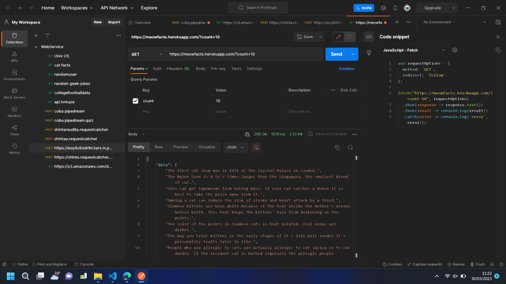
Terlihat 
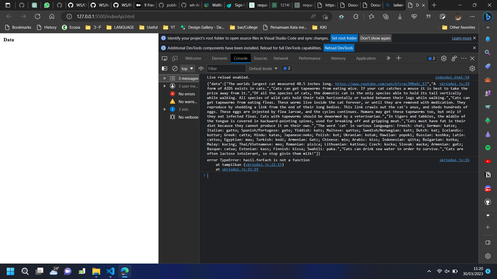

# 4. Lakukan pengujian https://requestcatcher.com/
1. Kunjungi link di atas
2. Isi tempat yang tersedia dengan apa saja, akan muncul tidak ada request
   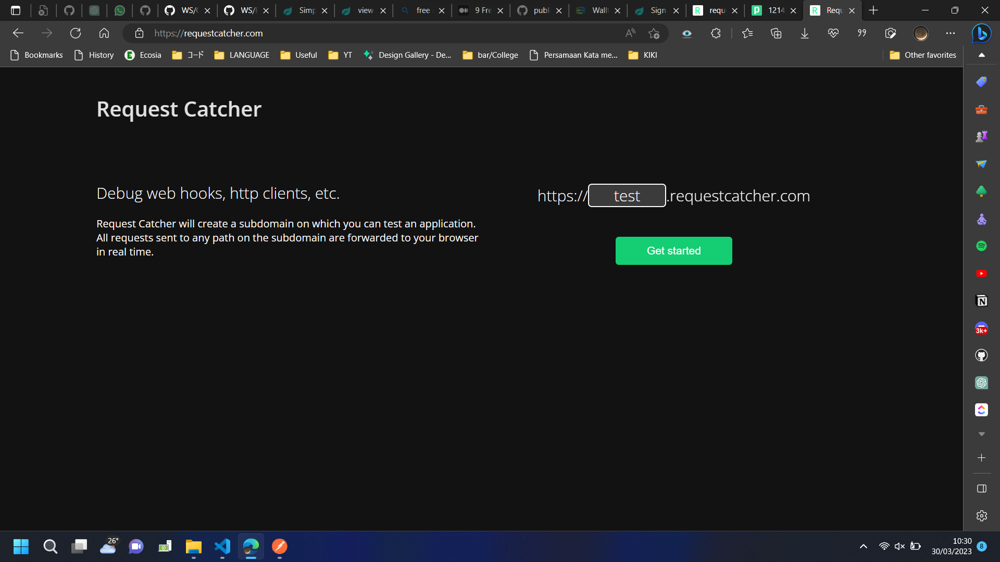
   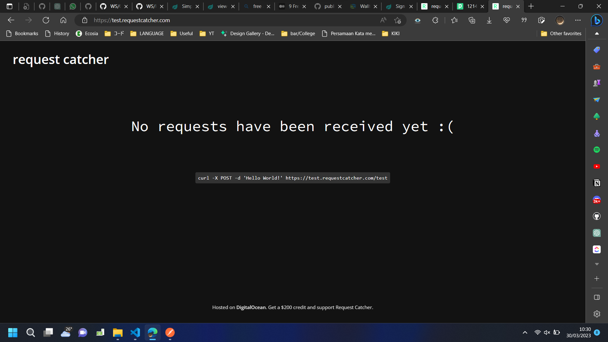
3. Copas link  https://test.requestcatcher.com/test ke Postman
4. Gunakkan metode POST. Headers isi dengan Key : Token ,   Value : Bebas. 
5. Pada body isi dengan data raw json lalu klik Send
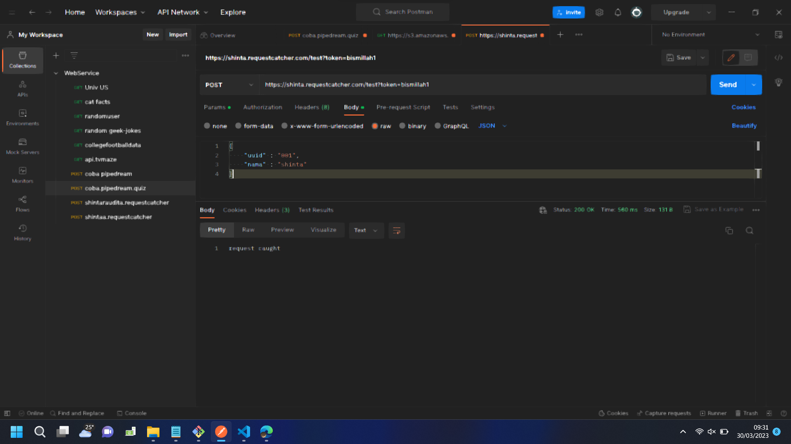
6. Requestcatcher akan menampilkan requests
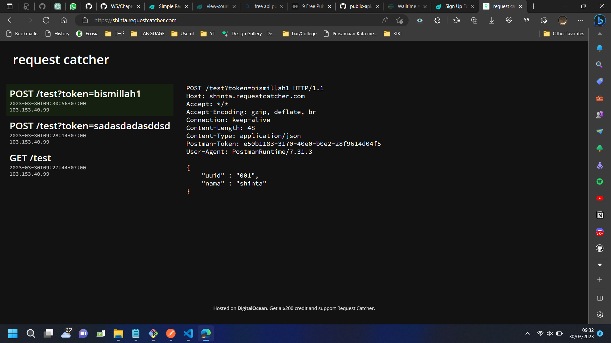

# 5. Membuat Endpoint dengan Postman dari Pipedream

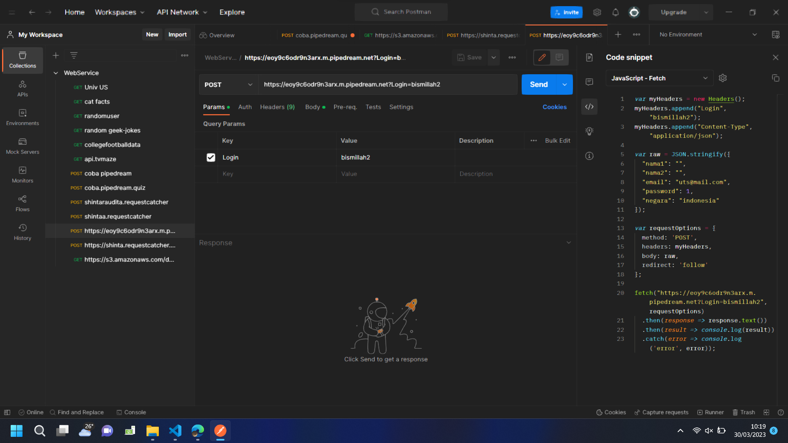
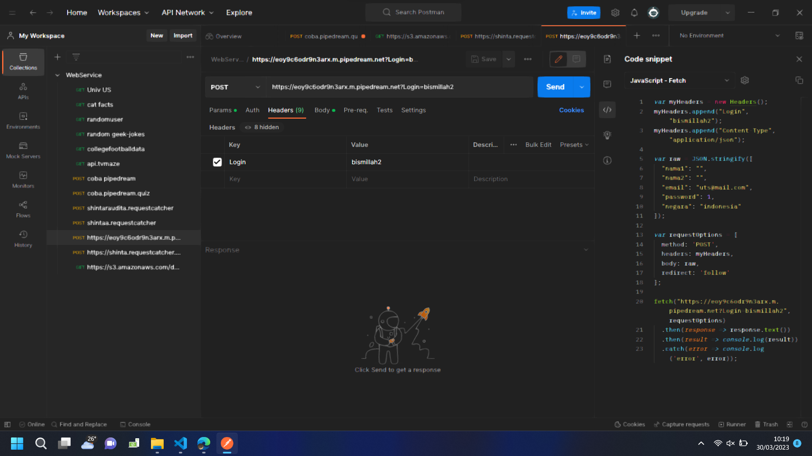
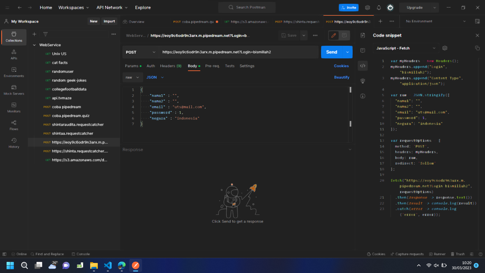
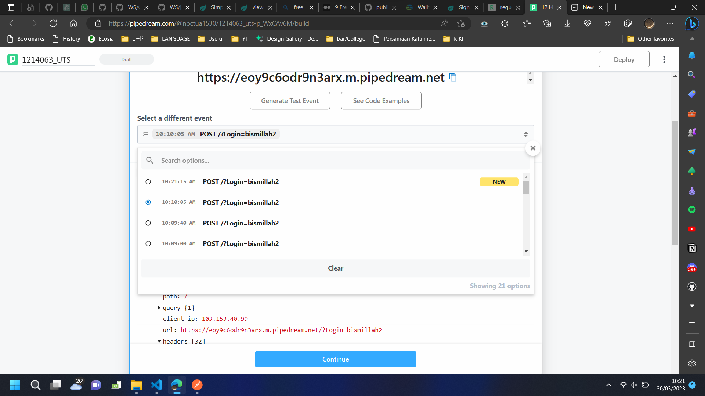
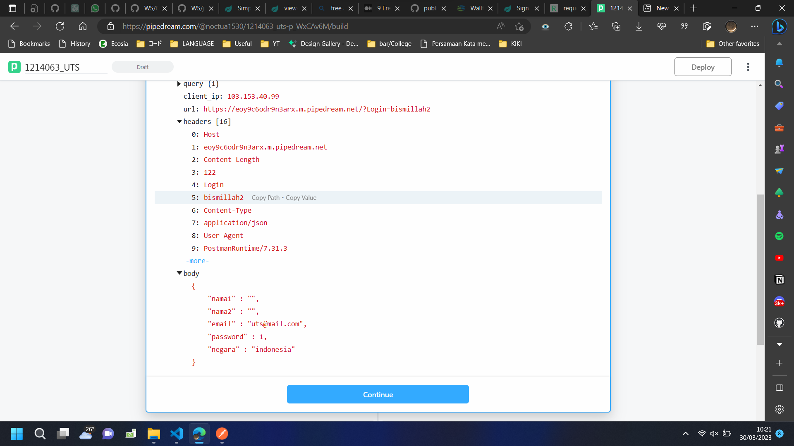

# 6. Tambah fungsi PostSignUp()
# 7. Buat fungsi PushButton()
# 8. Test dengan Open with Live Server
